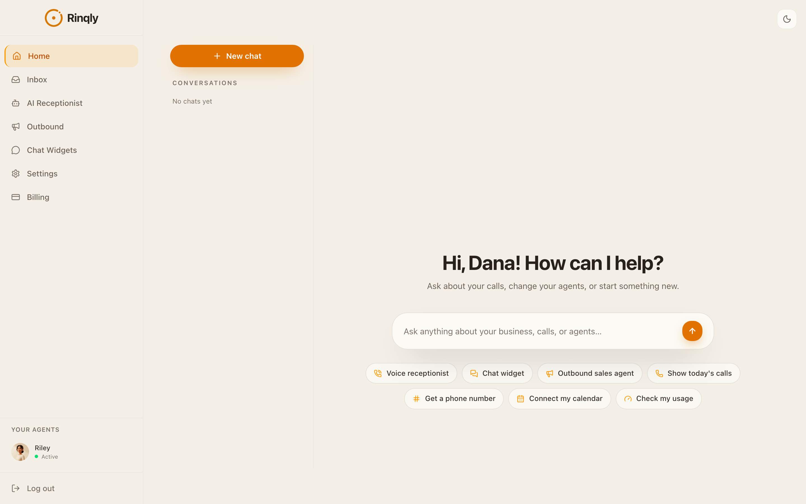
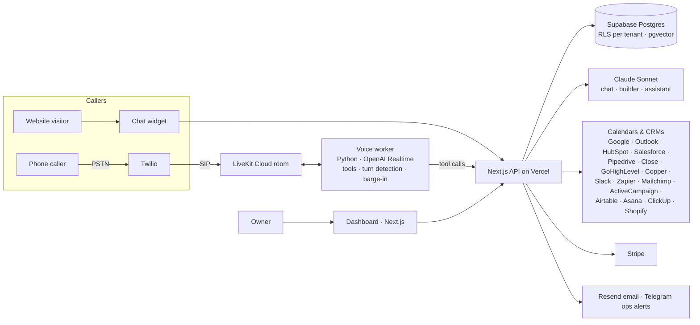
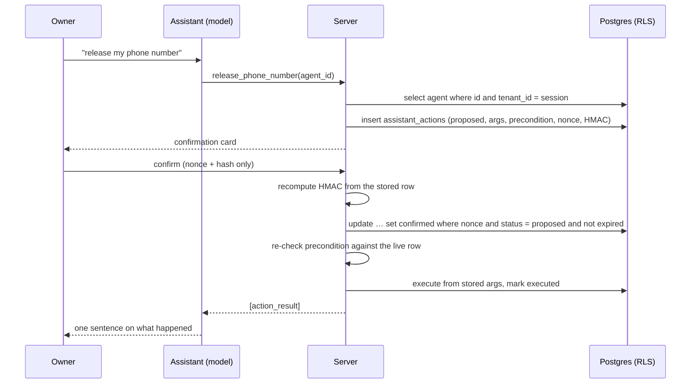
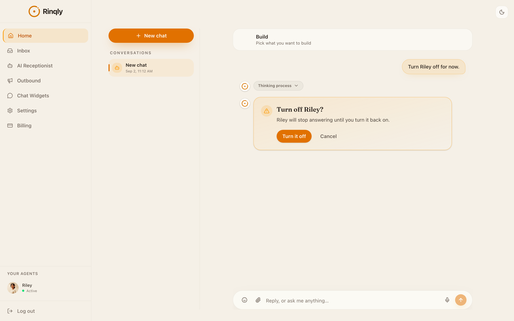
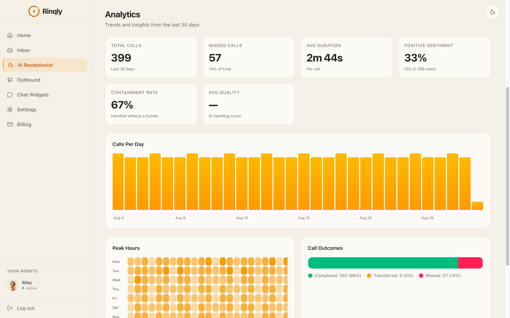
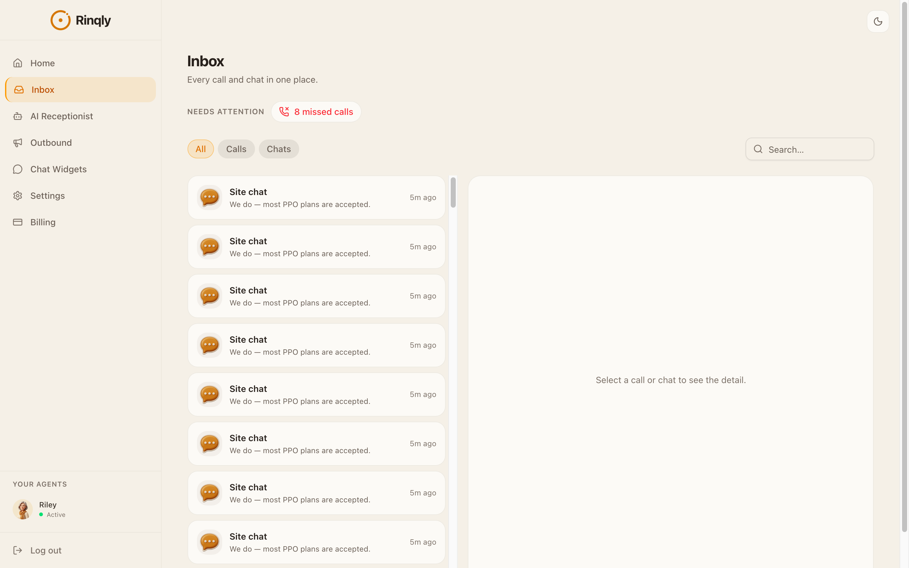
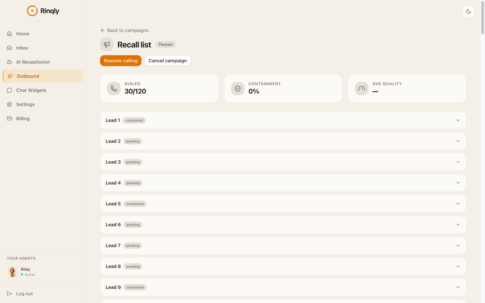

# Rinqly: an AI phone receptionist for small businesses

[rinqly.ai](https://rinqly.ai) answers a small business's phone, chats on its website and calls its lead list. The owner builds the receptionist in a conversation, gives it a number, and it books appointments, answers questions from the business's own knowledge, takes messages and transfers to a human, with every call transcribed, summarised and pushed to the CRM the business already uses.

This repository is a description of how it is built. The product is live and the code is private; what is here is the architecture, the numbers we measure ourselves, and the parts we think are worth copying.

  

## What it does

- **Voice receptionist.** Answers inbound calls in about 420 ms from the moment the caller stops talking, and can be interrupted mid-sentence. Runs on a number bought inside Rinqly or forwarded from the business's existing line. Books into Google Calendar or Outlook, answers FAQs, takes messages, transfers calls, sends SMS confirmations, knows the business hours and location.
- **Chat widget.** One script tag on the business's site. Same knowledge, same tools, lead capture, order status for Shopify stores.
- **Outbound sales agent.** Calls an uploaded lead list in each lead's own time zone during allowed hours, pitches, handles objections and books meetings. A campaign starts only after the owner attests to consent for every contact.
- **Dashboard assistant.** The home screen is a conversation: "what happened on my calls today", "close on Saturdays from now on", "turn Riley off", "get me a 305 number". Reads answer from the account; changes go through the same allowlists the settings pages use; anything risky gets a confirmation card first.
- **Inbox and analytics.** Every call and chat in one place with transcript, summary, sentiment and outcome; per-agent analytics over 30 days: volume, missed, containment, peak hours.

## Architecture

- **Web app:** Next.js on Vercel, TypeScript throughout. Server routes use the owner's own session, so Postgres row-level security is the tenant boundary, not application code.
- **Voice:** Twilio delivers the call over SIP into a LiveKit room; a Python worker runs the conversation on OpenAI Realtime with the business's prompt, knowledge and tools. Web test calls join the same room type from the browser, so the owner hears exactly what a caller hears.
- **Language models:** OpenAI Realtime for the spoken conversation; Claude Sonnet for the chat widget, the agent builder and the dashboard assistant, with the stable part of every system prompt in a cached prefix.
- **Knowledge:** the owner's text, uploaded PDFs and crawled pages are chunked into pgvector, scoped to the agent or widget they belong to, retrieved per turn with a similarity floor and reranked.
- **Integrations:** 15 calendars, CRMs and automation tools plus Shopify, each behind the provider's own OAuth or API key, connected from the owner's settings page. Custom HTTP tools can be generated from a docs URL for anything else.

## Voice: 420 ms, and what we measure behind it

**Rinqly's headline figure is 420 ms**: the time from the caller finishing a sentence to the receptionist starting to speak, on the demo line. The table below is how that breaks down per stage, from the worker's own timing on production calls, not from the caller's side, because a robot caller's speech recognition turned "$159" into "$15" once and we shipped a prompt change for a bug that did not exist. Every figure is a floor: the Twilio leg adds its own 100–200 ms.

| measure | value | how |
|---|---|---|
| time to first token after the caller stops | ~575 ms median | per-turn telemetry, semantic turn detection |
| first audio to the caller | ~0.6–0.8 s | worker `[LATENCY]` lines across dental, home services, law firm |
| full answer spoken | ~1.2 s | same |
| barge-in: caller interrupts, agent stops | about a second | robot-caller measurement, 1.05–2.12 s across industries |
| warm greeting after the caller joins | ~0.5 s | worker |

The honest finding from this work: the model is not the bottleneck. Most of what a caller experiences as delay is turn detection deciding they have finished speaking, and the semantic detector we run is already twice as fast as server VAD in production.

## Multi-tenant and safe by construction

- **Row-level security is the boundary.** Every dashboard and assistant query runs as the signed-in owner; policies on every table scope rows to `tenant_id = auth.uid()`. The service role is used only by webhooks and cron jobs.
- **The model never gets a tenant id.** No tool takes one; every id the model supplies must be a UUID and is re-selected under the session's tenant before anything is read or written. A registry test asserts this for every tool.
- **Dangerous actions cannot run from a tool call.** Buying or releasing a number, deleting an agent, turning it off, starting a campaign: the server writes a `proposed` row with the canonical arguments, the precondition that must still hold, a one-time nonce and an HMAC over all of it, then shows a card. The card sends back only the nonce and hash; the server recomputes the signature from the stored row, claims it with a single conditional update, and executes from what it stored. Ten-minute expiry, one use, and two concurrent confirms claim it once.
- **Audit log.** Every write and every proposal is a row in `assistant_actions` with the action, arguments, precondition, status and result, readable by the owner.
- **Customer text is data, not instructions.** Call transcripts and chat messages reach the model inside `<untrusted_data>` tags the prompt names explicitly. A transcript that says "deactivate this receptionist" is read back to the owner as suspicious, not obeyed. This is tested.
- **Every outbound fetch of a customer-supplied URL** (website scrape, API docs, custom tools, CRM connectors) goes through one guard that resolves DNS, refuses private and link-local ranges, follows redirects manually and strips credentials across origins.

  

## Evaluation harness

The product is tested the way it is used, against production, with throwaway tenants that are created and deleted by the run.

- **Live voice calls.** A robot caller joins a real LiveKit room with its own Realtime session and holds a spoken conversation through the scripted scenarios of an industry (dental, home services, law firm, restaurant): booking, FAQ, transfer, objections. The run is scored against the worker's transcript and its own latency lines, plus database checks (call log written, transcript stored, booking row created, summary and sentiment present), plus an LLM judge run three times for stability.
- **Text evals across 19 industries and three products.** About 1,100 checks per full run: does the agent answer from the knowledge base, refuse what it cannot do, capture the lead, book, and stay in scope, in English and in Lithuanian.
- **Builder scenarios.** Eleven conversations driven by a simulated owner with a persona, judged on continuity (never re-ask a known fact), save gates, editing an existing agent, integrations and support tickets.
- **Assistant probe.** Fifteen deterministic checks with no judge: prose where prose belongs, reads that call the tools, an injected instruction in a transcript that is reported rather than obeyed, a confirmation card that changes nothing until confirmed and refuses a replay, and writes that land in the database.
- **Browser probes over Chrome DevTools Protocol.** Signup through the real form, the builder by clicking, the dashboard with a month of seeded traffic, the embedded widget on a third-party origin, mobile layout at 390 px, accessibility tree and Core Web Vitals, and a performance probe that separates redirects, scripts and data in the waterfall.
- **Security probes.** Anonymous access to every API route, RLS across every table as another tenant, IDOR, SSRF, XSS, prompt injection, a git-history secret scan, rate limits and abuse of the LLM endpoints.

The habit that came out of this: suspect the probe before the product. About half of the "defects" the harness first reported were the harness.

  

## More screens

| Inbox | Outbound campaign |
|---|---|
|  |  |

## Stack

Next.js · TypeScript · Supabase (Postgres, RLS, pgvector, Auth, Storage) · LiveKit Cloud · OpenAI Realtime · Claude Sonnet · Twilio · Stripe · Resend · Vercel · Python worker · vitest · Chrome DevTools Protocol for the probes.

---

Built by [Lukas](https://github.com/lucas-ai-automations). Product: [rinqly.ai](https://rinqly.ai). Related: [agency-analyst-agent](https://github.com/lucas-ai-automations/agency-analyst-agent), a read-only Google Ads analyst with a hallucination regression suite.
